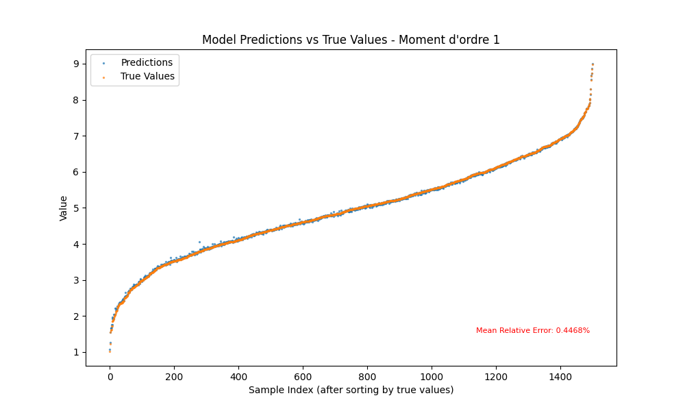
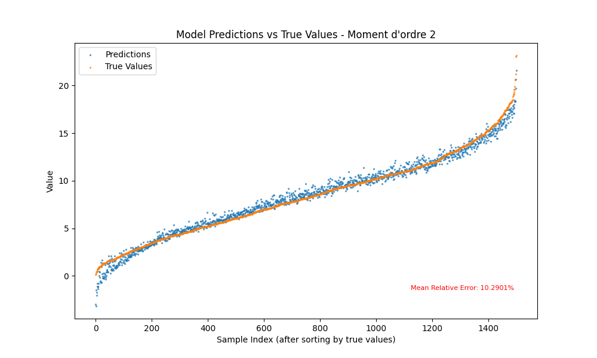
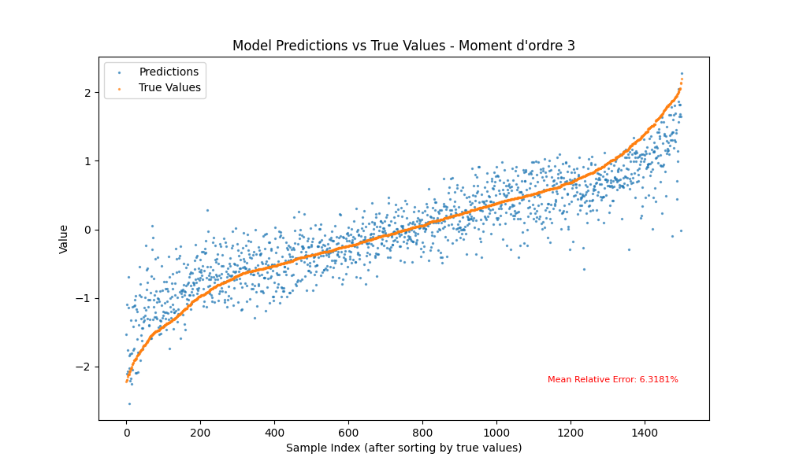
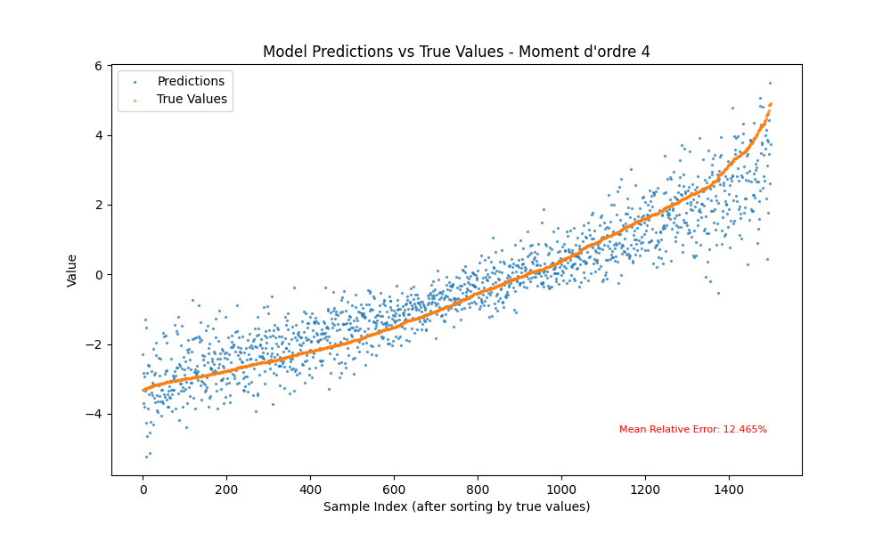
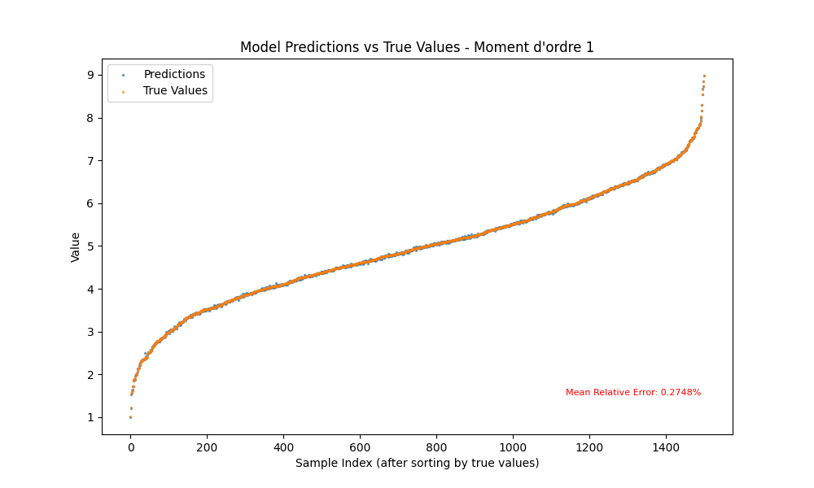
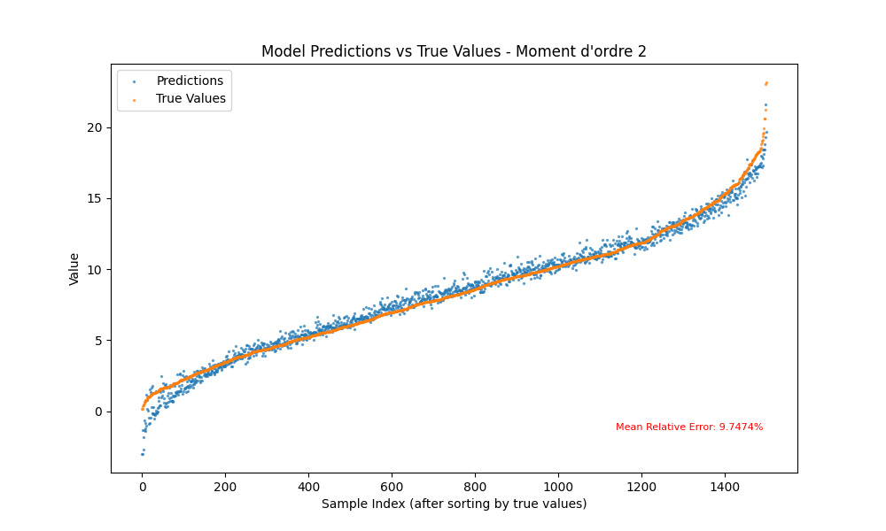
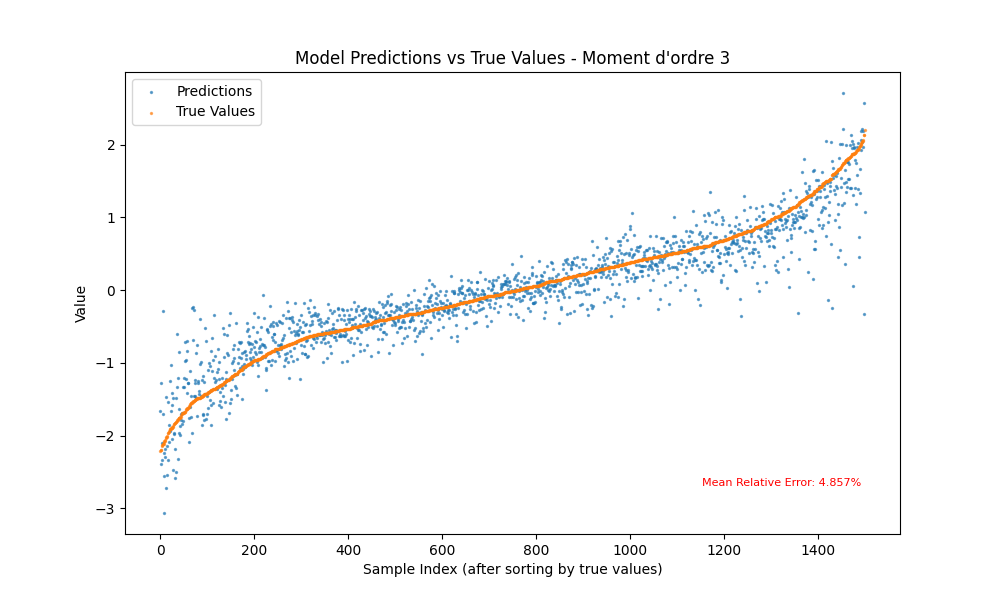
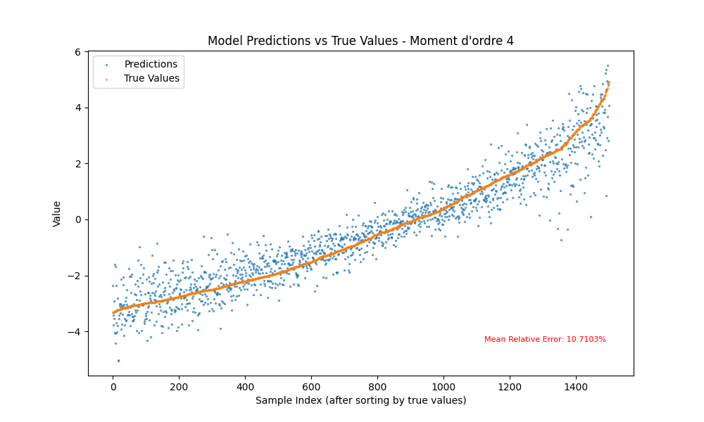

# Projet d'Apprentissage PyTorch : Prédiction des Moments satistiques empiriques de vecteurs

## Introduction

Ce projet personnel vise à me permettre d'apprendre à utiliser la syntaxe PyTorch. Ayant déjà plusieurs expériences avec TensorFlow et Keras, cela me permettra d'être à l'aise avec les 3 syntaxes principales de ML.

## Objectif du Projet

L'objectif principal est de construire et de former un réseau de neurones capable de prédire les quatre moments (moyenne, variance, skewness, kurtosis) d'une distribution de nombres réels. Il n'y a bien aucune application pratique et il s'agit d'un pur exercice. J'ai imaginé et choisi ce problème car d'une part il rend facile la génération des inputs et d'autre part il n'est pas trivial pour des réseaux d'architecture courante, ce qui me laissera l'occasion de tester plusieurs approches et mieux m'entraîner sur PyTorch, qui est justement pensé pour offrir plus de flexibilité.

 
 

1. Moyenne (Premier moment):
   $$\mu = \frac{1}{n} \sum_{i=1}^{n} x_i$$

2. Variance (Deuxième moment):
   $$\sigma^2 = \frac{1}{n} \sum_{i=1}^{n} (x_i - \mu)^2$$

3. Skewness (Troisième moment):
   $$\gamma_1 = \frac{n}{(n-1)(n-2)} \sum_{i=1}^{n} \left( \frac{x_i - \mu}{\sigma} \right)^3$$

4. Kurtosis (Quatrième moment):
   $$\gamma_2 = \frac{n(n+1)}{(n-1)(n-2)(n-3)} \sum_{i=1}^{n} \left( \frac{x_i - \mu}{\sigma} \right)^4 - \frac{3(n-1)^2}{(n-2)(n-3)}$$

## 0. Génération des inputs

On génère un dataset de 10000 vecteurs de taille 5, avec des réels compris entre 0 et 10.
Les 4 moments sont calculés et concaténés dans un tenseur de taille 10000x4 qui représente notre target.

## 1. Feedforward

Dans un premier temps on regarde les performances d'un simple réseau feedforward avec de hyperparamètres non-tunés.

- n_epoch : 100
- batch_size : 64
- Nombre de couches : 3
- Neurones par couche : 64
- Optimiseur : Adam
- Scheduler : StepLR

Pour prévenir l'overfitting, en plus de la régularization définie par le weight_decay dans Adam, on met également en place un mécanisme d'attention en comparant la loss de validation à la loss d'entraînement. Si la loss d'entrâinement devient inférieure à 0.7*training_loss, on cesse l'entraînement plus tôt.

 Paramètres d'entraînement :
- Taux d'apprentissage (lr) : 0.01
- Décroissance du poids (weight_decay) : 0.1
- Pas du scheduler (step_size) : 30
- Facteur gamma : 0.01

### Résultats initiaux :

Voir les résultats

### Hyperoptimisation :
Pour améliorer ces résultats, on procède à une hyperoptimisation avec Optuna, ciblant les paramètres suivants :

- Taux d'apprentissage (lr)
- Décroissance du poids (weight_decay)
- Pas du scheduler (step_size)
- Facteur gamma (gamma)
- Profondeur du réseau (depth)
- Largeur du réseau (width)

L'optimisation est faite en utilisant `TPESampler`, un échantillonneur bayésien par défaut dans Optuna pour le tuning d'hyperparamètres.

On obtient les résultats suivants :

best_hyperparameters = {
- 'lr': 0.0002778092206801126,
- 'weight_decay': 9.685749586479932e-10,
- 'step_size': 21,
- 'gamma': 0.3774761064868858,
- 'depth': 2,
- 'width': 256,
}

Voir les résultats

Les performances sont meilleures. Essayons de faire encore mieux !

### 2. ResNet

ResNet (Réseau Résiduel)

ResNet, abréviation de *Réseau Résiduel*, est une architecture de réseau de neurones convolutifs introduite pour la première fois par Kaiming He et al. dans le papier ["Deep Residual Learning for Image Recognition"](https://arxiv.org/abs/1512.03385) (2015). L'innovation clé de ResNet est l'introduction de **"connexions résiduelles"** qui permettent aux signaux de contourner une ou plusieurs couches.

Fonctionnement

Formellement, une couche résiduelle peut être décrite par la formule : y = F(x) + x

où `x` est l'entrée de la couche, `F(x)` est la transformation appliquée par les couches du réseau (par exemple, deux convolutions suivies d'une normalisation batch et d'une activation ReLU), et `y` est la sortie de la couche résiduelle. L'idée est de permettre au réseau d'apprendre des fonctions d'identité plus facilement, facilitant la propagation du gradient et permettant la construction de réseaux beaucoup plus profonds sans dégrader les performances.

Pertinence pour la Prédiction des Moments Statistiques

Dans le contexte de la prédiction des moments statistiques d'un vecteur de réels, l'utilisation de ResNet peut être particulièrement pertinente pour plusieurs raisons :

- **Profondeur du réseau :** La capacité à construire des réseaux profonds sans souffrir de la disparition ou de l'explosion du gradient est cruciale pour capturer les caractéristiques complexes et les relations non linéaires entre les entrées et les moments statistiques à prédire.
- **Apprentissage des caractéristiques :** Les connexions résiduelles favorisent l'apprentissage de transformations d'identité là où c'est nécessaire, permettant au réseau de se concentrer sur l'apprentissage des modifications utiles par rapport à l'identité, ce qui peut être avantageux pour la prédiction précise de propriétés statistiques basées sur les données d'entrée.

### 3. Transformer

### 4. Sous-ensemble
