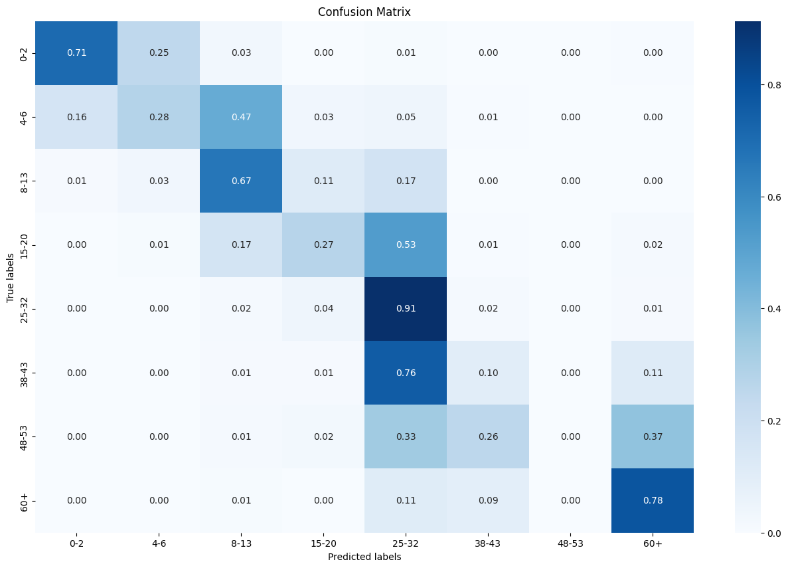
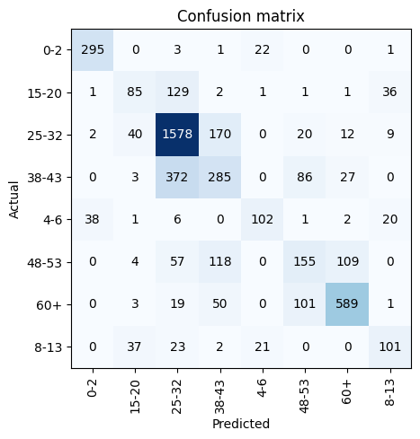
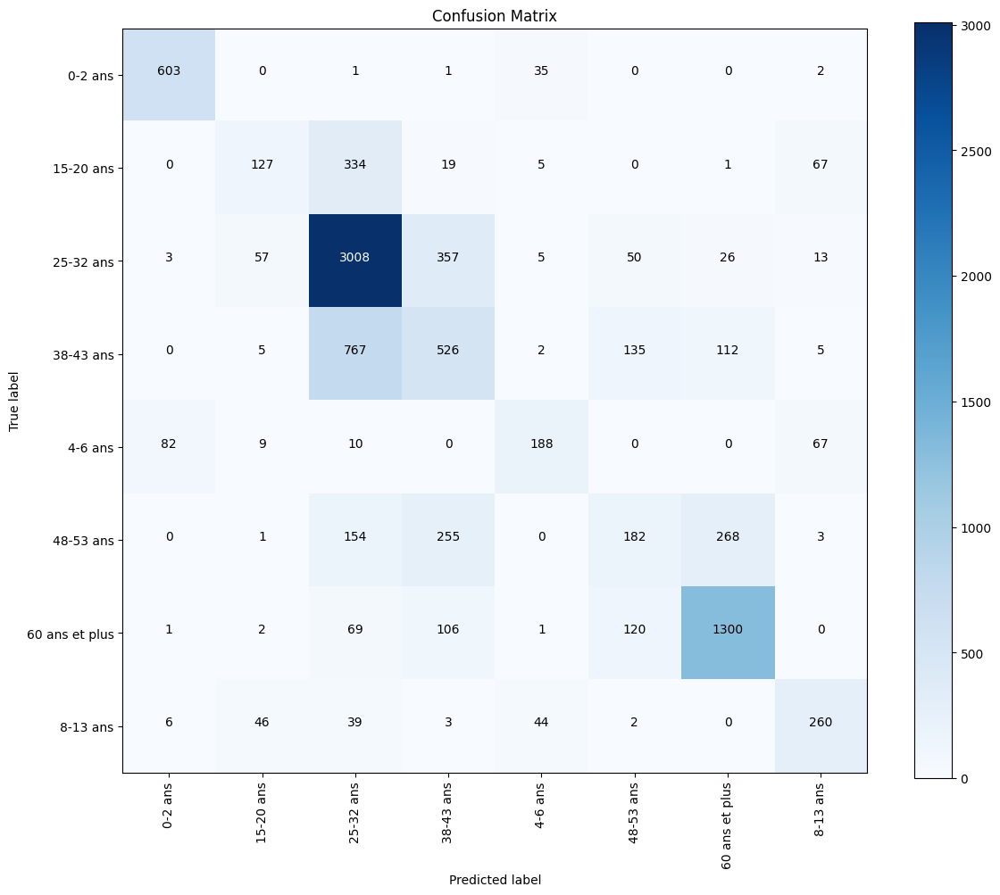

## Projet de prise en main de PyTorch/fastAI/transformers

### Préambule

Je me suis récemment beaucoup intéressé à la computer vision. Alors que j’étais en train de me renseigner sur quelques architectures (Capsule Networks, Vision Transformers…) je me suis dit qu’il serait intéressant de pratiquer un peu, pour deux raisons :
- Apprendre les librairies *PyTorch*, *fastAI* et *transformers*. Ayant déjà de l’expérience avec entre autres TensorFlow, Keras et lightGBM, cela me permettrai d'avoir une maîtrise assez complète des syntaxes de ML.
- Être plus à l’aise avec le processing d’images en général, le transfer learning et la manipulation de dataset lourds.

Les specs de mon ordinateur étant moyennes (bon GPU mais bottleneck au niveau du CPU et de la mémoire), j'ai pu tester des architectures de tailles petite à moyenne sans avoir à prendre la peine de faire du cloud computing. Le but n'est pas d'atteindre les performances de l'état de l'art, mais de me faire la main sur les librairies utiles de ML.

### Sommaire

1. Tâche choisie, court mot sur l'état de l'art
2. CNN simple et CapNet en PyTorch
3. ResNet avec fastai
4. ViT léger avec transformers
5. Conclusion
6. Références

### 1. Tâche choisie et benchmarking

Etant intéréssé par la computer vision et ayant pour objectif d'entamer dans un futur proche un projet personnel de computer vision nécéssitant du transfer learning, j'ai choisi pour m'entraîner ici une simple tâche de **classification d'âge à partir d'images de visage**.

Dataset choisi : UTKFace dataset (https://paperswithcode.com/dataset/utkface)

Le site *PapersWithCode* offre une vue synthétique des modèles proches du SOTA (state-of-the-art), du classement de leurs performances sur différentes tâches et dataset, ainsi que des publications correspondantes.
En l'occurence on pourra comparer nos performances en termes de classification (https://paperswithcode.com/sota/age-and-gender-classification-on-adience).

Parmi les modèles performant le mieux, on retrouve sans surprise des modèles de transformers récent comme MiVOLO-D1 [1] ou des Vision Transformers [2], et également des modèles plus classiques comme ResNet50 [3]. Entre 2018 et 2024, d'importants progrès on été faits, l'accuracy passant de 50% pour les CNN classiques à presque 85% pour les ViT (sur les classes du dataset Adience).

Je vais donc essayer de mettre en place :
- Un CNN simple
- Un ResNet
- Un ViT léger

### PyTorch - CNN

On utilise une pipeline de loading avec un custom Dataset qui crée les classes à partir du nom des images. Le preprocessing suivant est appliqué :
- Normalisation avec les valeurs de moyennes et écarts types dérivées d'ImageNet, communément utilisés pour le preprocessing [4].
- Resizing en 224x224
- Transformation avec RandomAffine pour ajouter de légères déformations, et augmenter la robustesse du modèle

On construit ensuite arbitrairement un CNN simple de composition suivante :
- Quatre blocs de convolution, chacun suivant le schéma Convolution-Batch Normalization-ReLU-Pooling, avec des filtres de convolution augmentant de 32 à 256 à travers les blocs. Après chaque bloc, un pooling maximal est appliqué.
- Deux couches de dropout pour réduire le surajustement, l'une après la conversion des caractéristiques en un vecteur aplati et l'autre entre les deux couches entièrement connectées. La première couche entièrement connectée réduit la dimensionnalité à 512, et la seconde produit la sortie finale avec un nombre de classes défini par num_classes.

On met en place une fonction d'entraînement avec optimizer Adam (qui inclut la régularisation des poids), scheduler LR, et un monitoring de la loss de validation. On met également en place une fonction d'hyperoptimisation par TPESampler Bayésien (librairie optuna).

Choix des classes : Pour pouvoir se comparer aux performances du site PaperWithCode, on adopte les mêmes classes que dans [1] :
- 0-2 ans
- 4-6 ans
- 8-13 ans
- 15-20 ans
- 25-32 ans
- 38-43 ans
- 48-53 ans
- 60+ ans

Résultats :

**Accuracy : 58.6%**

### PyTorch - CapsNet : Optimisation de VRAM

J'implémente ensuite et essaie d'entraîner l'architecture CapsNet [5].
Ici je run out de mémoire CUDA en raison du grand nombre de paramètres. Comme les layers de pooling sont contraire au paradigme du capsule network, qui est par nature un modèle lourd, j’essaie plutôt d'implémenter d’autres techniques pour soulager mon GPU :
- Réduction de la taille du batch
- Mixed précision en utilisant un scaler
- Gradient checkpointing

En testant sur le CNN j'observe bien une **réduction de l'utilisation de VRAM d'environ 30%**, mais sur le CapsNet avec une input 224x224 cela reste insuffisant pour les specs de mon PC (4GB de VRAM). En essayant de downscale le taille de l'input, on peut bel et bien entrâiner le modèle mais les performances chutent trop pour la classification d'âge.

### FastAI - ResNet

Les étapes de preprocessing décrites précédemment sont reproduites de manière compacte avec la syntaxe fastai.
On utilise un modèle ResNet34 pré-entrainé (ResNet50 étant trop lourd pour mon ordinateur). On applique la procédure usuelle de transfer learning consistant à d'abord fine-tuner la couche de sortie du modèle, puis à unfreeze tous les poids et entraîner le modèle entier avec une learning rate plus basse. [7]

Résultats :

**Accuracy : 67 %** 

### Transformers - Vision Transformer

Enfin on utilise un modèle de Vision Transformer. Comme il est trop couteux d'entraîner un transformer et qu'importer un modèle d'estimation d'âge pré-entrainé serait peu intéressant, j'ai décidé de mettre à l'épreuve un ViT extracteur de features robuste entrainé sur ImageNet : Dino [6]. Je choisit ici une version légère dinov2small (https://huggingface.co/facebook/dinov2-small) pré-entraîné, puis j'entraîne uniquement la couche de classification ajoutée par dessus.

Résultats :

**Accuracy : 65.3%**

Il est vraiment impressionnant d'observer que même sans entraîner le ViT et en n'entraînant que la couche de classification, les features robustes du modèle réduit permettent quand même d'atteindre une performance proche de ResNet. Il n'est pas étonnant que les ViT entièrement fine-tunés aient de très bonnes performances.

### Conclusion
Au travers de ces quelques expérimentations j'ai pu :
- Bien prendre en main de PyTorch, fastAI, et transformers.
- Implémenter des méthodes de transfer learning, de preprocessing d’image, de reduction de la memoire du GPU (mixed precision, gradient checkpointing) et d'hyperoptimisation.
- Lire un bon nombre d'articles clés de computer vision et améliorer ma compréhension de l'état de l'art actuel.

Références :

[1] Kuprashevich, M., & Tolstykh, I. (2023, July 10). MiVOLO: Multi-input Transformer for Age and Gender Estimation  
<https://arxiv.org/pdf/2307.04616v2.pdf>  
[2] Singh, A., & Singh, V. K. (2024, March 19). A Hybrid Transformer-Sequencer approach for Age and Gender classification from in-wild facial images.  
<https://arxiv.org/ftp/arxiv/papers/2403/2403.12483.pdf>  
[3] Paplham, J., & Franc, V. (2023, July 10). A Call to Reflect on Evaluation Practices for Age Estimation: Comparative Analysis of the State-of-the-Art and a Unified Benchmark.  
<https://arxiv.org/pdf/2307.04570v2.pdf>  
[4] Krizhevsky, A., Sutskever, I., & Hinton, G. E. (2012). ImageNet Classification with Deep Convolutional Neural Networks. Advances in Neural Information Processing Systems 25 (NIPS 2012)  
[5] Sabour, S., Frosst, N., & Hinton, G. E. (2017). Dynamic Routing Between Capsules. Google Brain, Toronto. Part of Advances in Neural Information Processing Systems 30 (NIPS 2017)  
<https://arxiv.org/pdf/1710.09829.pdf>  
[6] Oquab, M., Darcet, T., Moutakanni, T., Vo, H., Szafraniec, M., Khalidov, V., Fernandez, P., Haziza, D., Massa, F., El-Nouby, A., Assran, M., Ballas, N., Galuba, W., Howes, R., Huang, P.-Y., Li, S.-W., Misra, I., Rabbat, M., Sharma, V., ... Bojanowski, P. (2023). DINOv2: Learning Robust Visual Features without Supervision. arXiv:2304.07193 [cs.CV]. <https://arxiv.org/abs/2304.07193>  
[7] Iman, M., Arabnia, H. R., & Rasheed, K. (2023). A Review of Deep Transfer Learning and Recent Advancements. Technologies, 11(2), 40. <https://www.mdpi.com/2227-7080/11/2/40>

